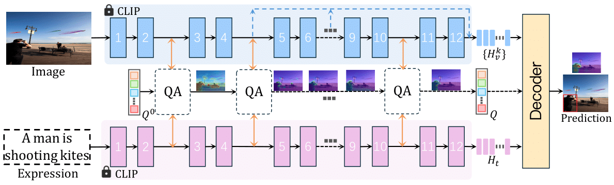

# Referencing Where to Focus: Improving Visual Grounding with Referential Query

source code of our paper [Referencing Where to Focus: Improving Visual Grounding with Referential Query](https://proceedings.neurips.cc/paper_files/paper/2024/file/54c67d3db2df24a31cf045525f9460b9-Paper-Conference.pdf)



### Dataset
- RefCOCO/+/g
- Flickr30K
- ReferItGame


### Training

```
sh run_grounding.sh
```


## Reference

If you find the package useful, please consider citing our paper:

```
@article{wang2025referencing,
  title={Referencing Where to Focus: Improving Visual Grounding with Referential Query},
  author={Wang, Yabing and Tian, Zhuotao and Guo, Qingpei and Qin, Zheng and Zhou, Sanping and Yang, Ming and Wang, Le},
  journal={Advances in Neural Information Processing Systems},
  volume={37},
  pages={47378--47399},
  year={2025}
}
```


